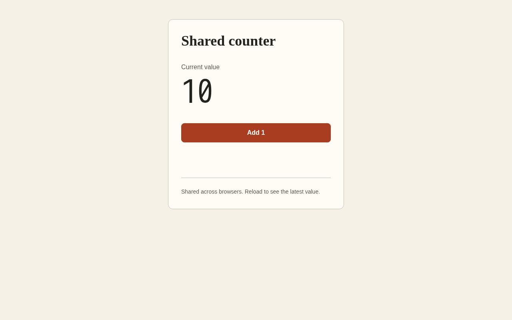

# Toy rehearsal evidence

This is the completed **MillieMoon shared-counter rehearsal**, preserved as evidence for the Tablekeeper factory. It is unscored practice, with accepted Stage 1 and Stage 2 outputs. Stages 3 and 4 were not built. The rehearsal included operator assistance, scope selection and recovery; it is not an uninterrupted autonomous four-stage run.

The [project snapshot](project/) preserves every tracked file from toy commit `aa2840c328527fbe33e80f1cff1e200ab1fea7aa`, byte for byte. Backend and Frontend BAND seats authored the application. The snapshot's README and FACTORY reports were assistant-assisted historical narratives. Their budgets, status statements and local audit paths describe the rehearsal checkpoint, not the current judged build.

## Browse the evidence

| Item | What it establishes |
| --- | --- |
| [Stage 1 source](project/stage-1/) and [reviewer report](reports/stage-1-reviewer.json) | Shared counter API; 8/8 official isolated checks passed at `bdfc842`. |
| [Stage 2 source](project/stage-2/) and [reviewer report](reports/stage-2-reviewer.json) | Browser UI; 12/12 official isolated checks passed at `b042c4a`, including the inherited eight API checks. |
| [Full BAND session](project/room.json) | Original full export: 1,616 messages, including handoffs, acceptance, failures, operator assistance and recovery. No filtering or rewriting. |
| [Offline check](reports/offline-check.json) | Exit 0; gates 1, 2 and the mandate part of gate 4 passed. This check does not run the service or replace the stage reports. |
| [Seven mandates](project/mandates/) | Roles and declared runtime/model for each seat. |
| [Original commit metadata](original-commits.json) | Commit IDs, parent relationships, trees and messages from the separate toy repository. |
| [Manifest](manifest.json) | Original provenance and SHA-256 hashes for the snapshot and retained evidence. |

Reports are preserved results from their recorded run times; packaging did not rerun the application or official harness. Original application and room bytes were compared with the committed snapshot. The stage source also matches each independently accepted revision. The original toy repository and its Git history remain in place.

## Preview



[Mobile screenshot](screenshots/mobile.png). These screenshots were captured during Designer review before the final keyboard-focus repair. The Stage 2 reviewer report identifies the accepted revision after that repair.

## Run the accepted app

From the root of this repository:

```sh
docker build -t tablekeeper-toy-stage-2 evidence/toy-rehearsal/project/stage-2
docker run --rm -p 127.0.0.1:9082:8080 -e PORT=8080 tablekeeper-toy-stage-2
```

Open http://localhost:9082/ and select **Add 1**. The count is shared across clients and resets when the process restarts. No external service is required. Port 9082 keeps this preview separate from the original examples on 8080.

See [Stage 1 RUN.md](project/stage-1/RUN.md) and [Stage 2 RUN.md](project/stage-2/RUN.md) for the original commands and endpoints.

## Preservation and privacy

This directory is an evidence snapshot, not a Git submodule or a running factory workspace. The manifest covers all retained artifacts except itself and this navigation README. Full export and reports retain historical agent identities, local paths and public room tool events. Private environment files, runtime credentials, caches and private model-session files are excluded. Text artifacts were checked with the factory credential detector and additional token/private-key patterns; a clean pattern scan is not a guarantee that a document contains no personal information. Repository visibility remains private.
